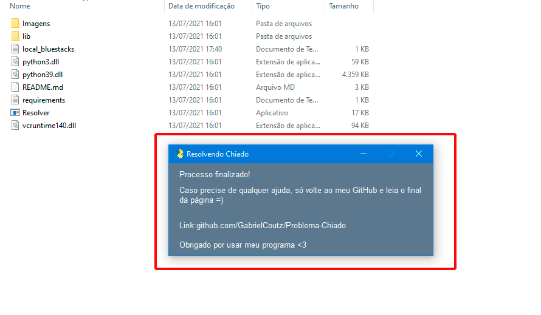

# Problema-Chiado
Um algoritmo que resolve o problema com chiado no Razer Sorround usando o programa BlueStacks ( ou pelo menos essa é a ideia XD )

Se vc tiver algum problema (óbvio que terá kkkk), olhe para o topo da página e clique em Issues --> New Issue, então descreva o que aconteceu, se possível com prints, após isso apenas aguarde o meu retorno =)

Ainda estou no início sobre programação, então peço que tenham paciência cmg ^^

Antes de iniciar um Issue, vc pode tentar abrir o arquivo local_bluestacks.txt que o algortimo criou e colocar manualmente o diretório do seu BlueStacks.exe

<h1>Como Utilizar?</h1>
 
1. Vá em **code** e clique em **Download ZIP**

2. Extraia o arquivo em uma pasta, pode colocar qualquer nome nessa pasta.

3. Abra a pasta extraída e execute **Resolver.exe**, não é necessário executar como administrador mas não tem problema se fizer isso

4. Aparecerá uma janela inicial, leia com atenção e clique em **Começar**

5. Após isso o programa começará a rodar, então é só esperar 1 minuto
> _PS: Colocarei um sinal para indicar que está rodando_

6. A janela final aparecerá, só ler e fechar

<h1>Pós execução</h1>

Agora, para que esse programa rode e resolva o problema sempre que o pc é ligado, precisamos adicioná-lo à pasta Inicializar do Windows.

1. Pressione **Windows** + **R** e digite **%appdata%**, depois clique em OK

2. Agora, siga esse caminho: _AppData --> Roaming --> Microsoft  --> Windows  --> Start Menu  --> Programs  --> Startup_
   1. Com vc pode estar em português, então as 3 últimas pastas serão _Menu Iniciar --> Programas --> Inicializar_

3. Volte à pasta em qu vc extraiu os arquivos. Clique com o botão direito em **Resolver** e clique em **Criar Atalho**

4. Agora basta colocar esse atalho para dentro da pasta _Inicializar_ para que rode quando o windows iniciar

5. Para finalizar, pode colocar a pasta com todos os arquivos em qualquer lugar _(não apague)_, depois disso reinicie o pc e veja a mágica acontecer kkk
