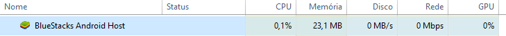

<h1 align='center'>Resolver Chiado no Razer Sorround</h1>

Existem 2 maneiras que é possível resolver seu problema com o Chiado:

**1°** - Usando o programa **BlueStacks**

**2°** - Usando o programa **DPC Latency**
<h1 align='center'>Qual a diferença?</h1>

Ambos conseguem parar o Chiado ao serem executados, porém, com o **BlueStacks** o consumo de **memória RAM** é mais alto:

Em relação do **DPC Latency**:

Também tem a diferença que, o **BlueStacks** vc precisa baixar e instalar. Já o **DPC Latency** basta baixá-lo, sem executar ou qualquer alteração.

Ou seja, ambos podem acabar com seu problema, só resta a vc escolher qual programa utilizar =)

<h1 align='center'>Links</h1>
Faça sua escolha e após isso, entre em um dos links abaixo:

**[Utilizar BlueStacks](https://github.com/GabrielCoutz/Usando-BlueStacks/blob/main/README.md)**

**[Utilizar DPC Latency] MANUTENÇÂO**
