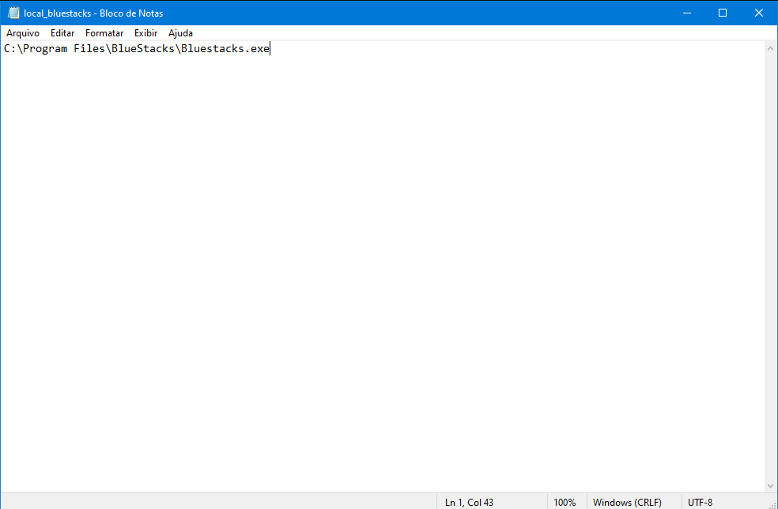

# Resolver Chiado no Razer Sorround

Estou aprendendo a programar, então fiz esse código para ajudar a resolver o problema com chiado nos fones razer utilizando o programa BlueStacks
 

<h1>Como Utilizar?</h1>
 
1. Vá em **code** e clique em **Download ZIP**

2. Extraia o arquivo em uma pasta, pode colocar qualquer nome nessa pasta.

3. Abra a pasta extraída e execute **Resolver.exe**, não é necessário executar como administrador mas não tem problema se fizer isso

4. Aparecerá uma janela inicial, leia com atenção e clique em **Começar**

5. Após isso o programa começará a rodar, então é só esperar 1 minuto
> _PS: Colocarei um sinal para indicar que está rodando_

6. A janela final aparecerá, só ler e fechar

<h1>Pós execução</h1>

Agora, para que esse programa rode e resolva o problema sempre que o pc é ligado, precisamos adicioná-lo à pasta Inicializar do Windows.

1. Pressione **Windows** + **R** e digite **%appdata%**, depois clique em OK

2. Agora, siga esse caminho: _AppData --> Roaming --> Microsoft  --> Windows  --> Start Menu  --> Programs  --> Startup_
   1. Com vc pode estar em português, então as 3 últimas pastas serão _Menu Iniciar --> Programas --> Inicializar_

3. Volte à pasta em que vc extraiu os arquivos. Clique com o botão direito em **Resolver** e clique em **Criar Atalho**

4. Agora basta colocar esse atalho dentro da pasta _Inicializar_ para que rode quando o windows iniciar

5. Para finalizar, pode colocar a pasta com todos os arquivos em qualquer lugar _(não apague)_, depois disso reinicie o pc e veja a mágica acontecer kkk

<h1>Deu ruim x_x ?</h1>

Caso tenha ocorrido algum erro (óbvio que terá kkkk), siga os passos a seguir

1. Procure onde está instalado o seu **BlueStacks**, na barra de pesquisa do Windows digite **Bluestacks**. Em seguida clique com o botão direito e vá em **Abrir local do arquivo**

2. Na pasta que abriu, clique com o botão direito em **BlueStacks** e vá até **Propriedades**

3. Copie o diretório que está em **Destino**

4. Vá até pasta onde estão os arquivos desse programa e abra o arquivo de texto **local_bluestacks.txt**

5. Cole e retire as aspas **"** que estão no início e fim, deve ficar limpo, igual à imagem de exemplo abaixo!!

6. Agora salve, feche e tente rodar novamente =)
